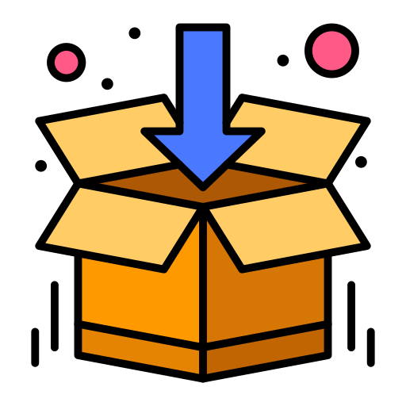

 
Icons made by <a href="https://www.flaticon.com/authors/flatart-icons" title="flatart_icons">flatart_icons</a> from <a href="https://www.flaticon.com/" title="Flaticon">www.flaticon.com</a>

# BB Flutter Extension Pack

 The BB's Extension Pack which includes every extension you will ever need for Flutter development.

 ---

## Table of Contents

- [BB Flutter Extension Pack](#bb-flutter-extension-pack)
  - [Table of Contents](#table-of-contents)
  - [Installation](#installation)
  - [Extensions](#extensions)
    - [Flutter Extensions](#flutter-extensions)
    - [Productivity Extensions](#productivity-extensions)
    - [Git Extensions](#git-extensions)
    - [API](#api)
  - [Tips](#tips)
  - [Contribution](#contribution)
    - [How to contribute?](#how-to-contribute)
  - [License](#license)

---

## Installation

- Open VS Code and click on Extensions Icon in the Activity Bar.
- Type **xsnepaul.bb-flutter-extension-pack**
- Install the Extension Pack.

*☕️ Have a cup of coffee... There're more than 50 extensions.*

## Extensions

### Flutter Extensions

- [Awesome Flutter Snippets](https://marketplace.visualstudio.com/items?itemName=Nash.awesome-flutter-snippets) - Awesome Flutter Snippets is a collection snippets and shortcuts for commonly used Flutter functions and classes.
- [Dart](https://marketplace.visualstudio.com/items?itemName=Dart-Code.dart-code) - Dart language support and debugger for Visual Studio Code.
- [Flutter](https://marketplace.visualstudio.com/items?itemName=Dart-Code.flutter) - Flutter support and debugger for Visual Studio Code.
- [Flutter Color](https://marketplace.visualstudio.com/items?itemName=circlecodesolution.ccs-flutter-color) - A user friendly plugin to help you work with ARGB Color in VS Code, for any project.
- [Flutter Snippets](https://marketplace.visualstudio.com/items?itemName=MarufHassan.flutter-snippets) - Supercharge your Flutter workflow with handy Snippets for VS Code
- [Pubspec Dependency Search](https://marketplace.visualstudio.com/items?itemName=everettjf.pubspec-dependency-search) - Easy search dependency name in dart packages site for flutter developers.
- [Flutter Helpers](https://marketplace.visualstudio.com/items?itemName=aksharpatel47.vscode-flutter-helper) - Easily write JSONSerializable annotated classes and allows you to run code generation for those classes. You can also watch the files so that code generation is faster.
- [Flutter Intl](https://marketplace.visualstudio.com/items?itemName=localizely.flutter-intl) - Create a binding between your translations from .arb files and your Flutter app. It generates boilerplate code for official Dart Intl library and adds auto-complete for keys in Dart code.
- [Flutter Tree](https://marketplace.visualstudio.com/items?itemName=marcelovelasquez.flutter-tree) - Build basic widget tree with nice syntax.
- [Dart Data Class Generator](https://marketplace.visualstudio.com/items?itemName=BendixMa.dart-data-class-generator): Create dart data classes easily, fast and without writing boilerplate or running code generation.
- [flutter-stylizer](https://marketplace.visualstudio.com/items?itemName=gmlewis-vscode.flutter-stylizer) - Organizes your Flutter classes in an opinionated and consistent manner.
- [fish-redux-template](https://marketplace.visualstudio.com/items?itemName=huangjianke.fish-redux-template) - [Fish Redux](https://github.com/alibaba/fish-redux) is an assembled flutter application framework based on Redux state management. It is suitable for building medium and large applications.
- [dart-import](https://marketplace.visualstudio.com/items?itemName=luanpotter.dart-import) - A simple plugin for VSCode to change all Dart/Flutter imports to relative format.
- [Flutter & Dart Utilities](https://marketplace.visualstudio.com/items?itemName=RodrigoRahman.flutter-dart-utils) - Extension that assists in the creation of tests, interfaces, classes and to work with clean architecture, 3-tiers or MVC having the possibility to create features and create tests folder.

### Productivity Extensions

- [EditorConfig for VS Code](https://marketplace.visualstudio.com/items?itemName=EditorConfig.EditorConfig) - This plugin attempts to override user/workspace settings with settings found in .editorconfig files. No additional or vscode-specific files are required. As with any EditorConfig plugin, if root=true is not specified, EditorConfig will continue to look for an .editorconfig file outside of the project.
- [EditorConfigGenerator](https://marketplace.visualstudio.com/items?itemName=nepaul.editorconfiggenerator) - Generate a simple editor config file for usual situation.
- [Code Spell Checker](https://marketplace.visualstudio.com/items?itemName=streetsidesoftware.code-spell-checker)
- [Bookmarks](https://marketplace.visualstudio.com/items?itemName=alefragnani.Bookmarks) - Mark and jump.
- [Todo Tree](https://marketplace.visualstudio.com/items?itemName=Gruntfuggly.todo-tree) - This extension quickly searches (using ripgrep) your workspace for comment tags like TODO and FIXME, and displays them in a tree view in the explorer pane. Clicking a TODO within the tree will open the file and put the cursor on the line containing the TODO.
- [Project Manager](https://marketplace.visualstudio.com/items?itemName=alefragnani.project-manager) - Easily switch between projects.
- [Docs View](https://marketplace.visualstudio.com/items?itemName=bierner.docs-view) - Displays hover documentation in the sidebar or panel.
- [PlantUML](https://marketplace.visualstudio.com/items?itemName=jebbs.plantuml)
- [filesize](https://marketplace.visualstudio.com/items?itemName=mkxml.vscode-filesize) - This package is intended for use with the Visual Studio Code editor and it displays the size of the focused file in the status bar of the editor.
- [Version Lens](https://marketplace.visualstudio.com/items?itemName=pflannery.vscode-versionlens) - This extension shows version information when opening a package or project for one of the following:

  - dotnet <https://www.dotnetfoundation.org/>
  - dub <https://code.dlang.org/>
  - jspm <https://jspm.io/>,
  - maven <https://maven.apache.org/>
  - npm <https://www.npmjs.com/>
  - pub <https://pub.dev/>
  - composer <https://getcomposer.org/>
- [Paste JSON as Code](https://marketplace.visualstudio.com/items?itemName=quicktype.quicktype) - Supports TypeScript, Python, Go, Ruby, C#, Java, Swift, Rust, Kotlin, C++, Flow, Objective-C, JavaScript, Elm, and JSON Schema.
- [Project Snippets](https://marketplace.visualstudio.com/items?itemName=rebornix.project-snippets) - Provide workspace/project level code snippets.
- [Sort JSON objects](https://marketplace.visualstudio.com/items?itemName=richie5um2.vscode-sort-json) - Alphabetically sorts the keys in selected JSON objects.
- [Live Server](https://marketplace.visualstudio.com/items?itemName=ritwickdey.LiveServer) - Launch a local development server with live reload feature for static & dynamic pages.
- [Partial Diff](https://marketplace.visualstudio.com/items?itemName=ryu1kn.partial-diff)
  - You can compare (diff) text selections within a file, across different files, or to the clipboard.
  - Multi cursor text selection.
  - User defined text normalization rules to reduce the noise in the diff (e.g. replace tab characters to spaces).
  - User defined text normalization rules can be toggled off without removing them from the configuration.
  - Compare text in 2 visible editors (i.e. tabs) with one action.

**AI Coding**:

- [GitHub Copilot](https://marketplace.visualstudio.com/items?itemName=GitHub.copilot) - An AI pair programmer which suggests line completions and entire function bodies as you type. GitHub Copilot is powered by the OpenAI Codex AI system, trained on public Internet text and billions of lines of code.
- [Tabnine AI Autocomplete for Javascript, Python, Typescript, PHP, Go, Java, Ruby & more](https://marketplace.visualstudio.com/items?itemName=TabNine.tabnine-vscode)
- [Codelf](https://marketplace.visualstudio.com/items?itemName=unbug.codelf) - Search over projects from Github, Bitbucket, Google Code, Codeplex, Sourceforge, Fedora Project, GitLab to find real-world usage variable names.
- [Colonize](https://marketplace.visualstudio.com/items?itemName=vmsynkov.colonize) - Adds three shotcuts to insert semicolons with ease;
  - shift + enter Insert semicolon at the end of line and continue on the same line
  - alt + enter Insert semicolon at the end of line and continue on the new line
  - ctrl + alt + enter Insert semicolon and stay at the same position
- [change-case](https://marketplace.visualstudio.com/items?itemName=wmaurer.change-case)

**Images**:

- [SVG](https://marketplace.visualstudio.com/items?itemName=jock.svg) - A Powerful SVG Language Support Extension. Almost all the features you need to handle SVG.
- [Svg Preview](https://marketplace.visualstudio.com/items?itemName=SimonSiefke.svg-preview)

**Comments**:

- [Better Comments](https://marketplace.visualstudio.com/items?itemName=aaron-bond.better-comments) - Create more human-friendly comments in your code.
With this extension, you will be able to categorise your annotations into:

  - Alerts
  - Queries
  - TODOs
  - Highlights
  - Commented out code can also be styled to make it clear the code shouldn't be there
  - Any other comment styles you'd like can be specified in the settings

**Markdown**:

- [Markdown All in One](https://marketplace.visualstudio.com/items?itemName=yzhang.markdown-all-in-one) - All you need for Markdown (keyboard shortcuts, table of contents, auto preview and more).
- [markdownlint](https://marketplace.visualstudio.com/items?itemName=DavidAnson.vscode-markdownlint) - Linting and style checking.
- [Markdown Notes](https://marketplace.visualstudio.com/items?itemName=kortina.vscode-markdown-notes) - Use [[wiki-links]], backlinks, #tags and @bibtex-citations for fast-navigation of markdown notes.
- [Gray Matter](https://marketplace.visualstudio.com/items?itemName=philipbe.theme-gray-matter) - A pair of colour schemes for writing Markdown in Sublime Text, Visual Studio Code, and other .tmTheme editors. It takes aesthetic cues from popular minimalist writing apps and aims to lessen the visual impact of markdown punctuation. It also attempts to support the full range of Markdown syntax ranging from Markdown, MultiMarkdown, Github Flavoured Markdown, and Pandoc Markdown.
- [Markdown Links](https://marketplace.visualstudio.com/items?itemName=tchayen.markdown-links)
  Adds command Show Graph that displays a graph of local links between Markdown files in the current working directory.

  Gives better insights into structure of your files if you are writinga wiki, a Zettelkasten style notebook or documentation.

**Themes**:

- [Dracula Official](https://marketplace.visualstudio.com/items?itemName=dracula-theme.theme-dracula)
- [Community Material Theme](https://marketplace.visualstudio.com/items?itemName=Equinusocio.vsc-community-material-theme)
[Material Icon Theme](https://marketplace.visualstudio.com/items?itemName=PKief.material-icon-theme)

### Git Extensions

- [gitignore](https://marketplace.visualstudio.com/items?itemName=codezombiech.gitignore) - Start command palette (with Ctrl+Shift+P or F1) and start typing Add gitignore.
- [Git Blame](https://marketplace.visualstudio.com/items?itemName=waderyan.gitblame) - See Git Blame information in the status bar for the currently selected line. Quick link to open the latest commit on the current line in the most popular online git tools.
- [git-commit-plugin](https://marketplace.visualstudio.com/items?itemName=redjue.git-commit-plugin) - Automatically generate git commit messages, follows the Angular Team Commit Specification.
- [GitLens](https://marketplace.visualstudio.com/items?itemName=eamodio.gitlens) - GitLens supercharges the Git capabilities built into Visual Studio Code. It helps you to visualize code authorship at a glance via Git blame annotations and code lens, seamlessly navigate and explore Git repositories, gain valuable insights via powerful comparison commands, and so much more.
- [Git History](https://marketplace.visualstudio.com/items?itemName=donjayamanne.githistory) - Git History, Search and More (including git log)
- [Gitflow](https://marketplace.visualstudio.com/items?itemName=vector-of-bool.gitflow)

### API

- [REST Client](https://marketplace.visualstudio.com/items?itemName=humao.rest-client) - Allows you to send HTTP request and view the response in Visual Studio Code directly.
- [Proto Lint](https://marketplace.visualstudio.com/items?itemName=Plex.vscode-protolint) -  A protocol buffer linter for Visual Studio Code that uses protolint to validate linting rules.
- [vscode-proto3](https://marketplace.visualstudio.com/items?itemName=zxh404.vscode-proto3)

---

## Tips

- How to export extensions list: `code --list-extensions | xargs -L 1 echo code --install-extension`

## Contribution

 **Contribution is welcomed. I intend to update the Extensions monthly to keep it updated with the best extensions.**

### How to contribute?

1. Create a new issue
1. Click on Extension request
1. Mention the Extension name with the Publisher Name and provide the Extension link.

---

## License

- **[MIT license](https://github.com/nepaul/bb-flutter-extension-pack/blob/master/LICENSE)**
